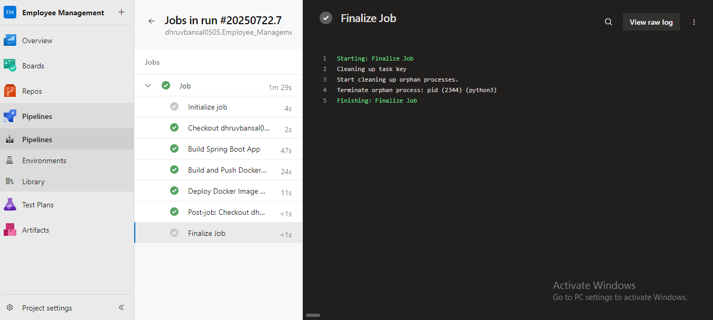

# Employee_Management

A full-stack web application built with **Spring Boot**, **Spring Data JPA**, **Thymeleaf**, and **MySQL**, featuring CRUD operations for employee records and integrated with **Azure DevOps** for CI/CD.

---

## 🌟 Features

- Add, view, update, and delete employee records
- Responsive UI with Thymeleaf and Bootstrap
- Persistent storage via MySQL (JPA/Hibernate)
- (Optional) User authentication and pagination/sorting
- CI/CD pipeline setup using Azure DevOps

---


## 📂 Project Structure

Employee\_Management/
├── src/
│   ├── main/
│   │   ├── java/...         # Controllers, Services, Repositories, Entities
│   │   └── resources/
│   │       ├── templates/   # Thymeleaf HTML pages
│   │       └── application.properties
├── azure-pipelines.yml      # Pipeline definition for Azure DevOps
└── README.md


---

## 🛠️ Prerequisites

- Java JDK 11+ (or 17+)
- Maven
- MySQL server
- Git

---

## 🚀 Getting Started

1. **Clone the repository**

   git clone https://github.com/dhruvbansal0505/Employee_Management.git
   cd Employee_Management

2. **Configure MySQL**

   * Create a database (e.g., `employee_db`)
   * Update `src/main/resources/application.properties`:

     spring.datasource.url=jdbc:mysql://localhost:3306/employee_db
     spring.datasource.username=YOUR_USERNAME
     spring.datasource.password=YOUR_PASSWORD
     spring.jpa.hibernate.ddl-auto=update

3. **Build & Run**

   ```bash
   mvn clean install
   mvn spring-boot:run
   ```

4. **Access the Application**

   * Open [http://localhost:8080](http://localhost:8080) in your browser

---


## ☁️ Azure DevOps CI/CD

You can automate builds and deployments by following these steps:

1. In Azure DevOps:

   * Create a **Pipeline** using the `azure-pipelines.yml` in your repo
2. Run the pipeline to build and test the app.

### Azure DevOps Pipeline




---

## 🧑‍💻 Usage Instructions for Others

1. Clone the repo
2. Update `application.properties` with your DB credentials
3. Build and run (see Instructions above)
4. Interact via web UI at `http://localhost:8080`
5. Optional: Test backend APIs using Postman or Swagger

---

## ⚙️ Packaging as JAR (Optional)

To package your app:

```bash
mvn clean package
java -jar target/employee-management-0.0.1-SNAPSHOT.jar
```

---

## 🤝 Contributing

Contributions are welcome!
To contribute:

1. Fork the repo
2. Create a branch (`feature/your-idea`)
3. Commit, push, and open a pull request

---


## 📞 Contact

**Author**: Dhruv Bansal
📧 [dhruvbansal0505@gmail.com](mailto:dhruvbansal0505@gmail.com)
🔗 [GitHub Profile](https://github.com/dhruvbansal0505)

```
